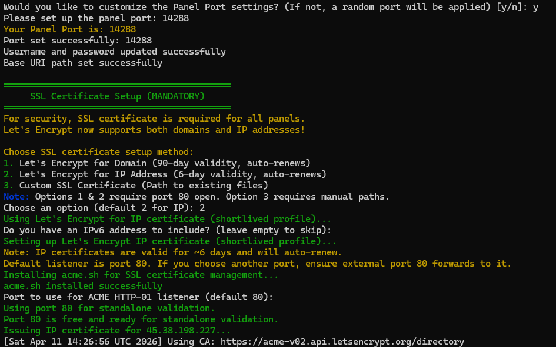
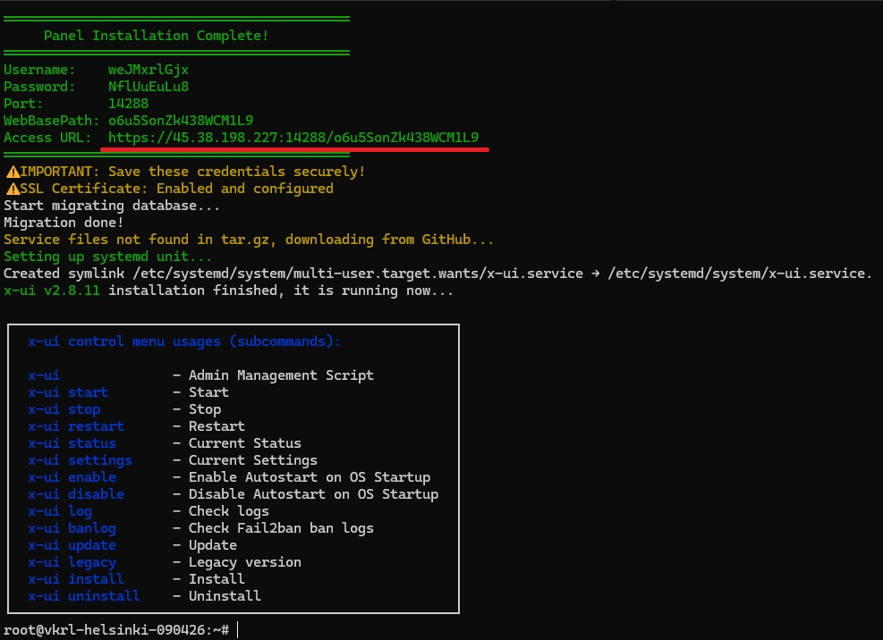
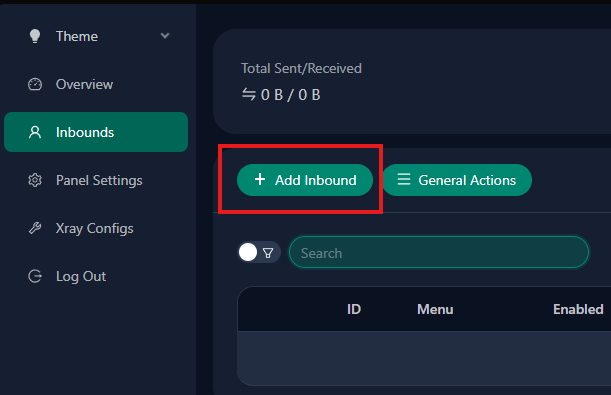
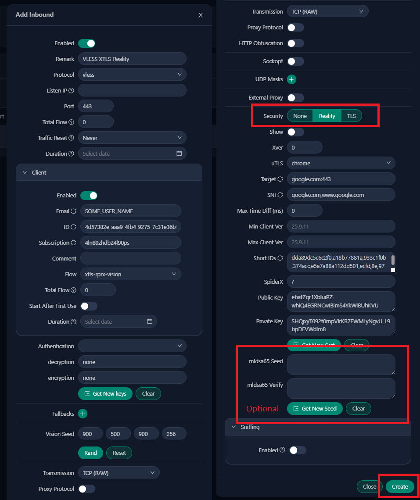
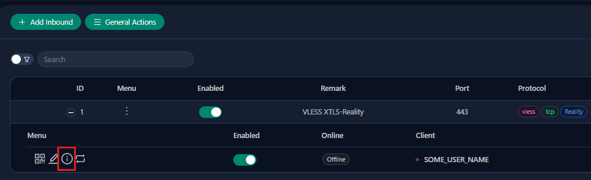
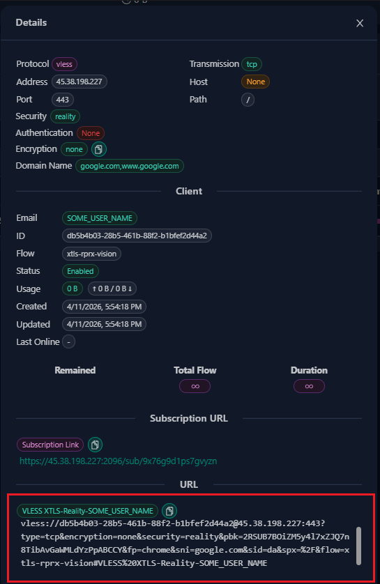

# VPN + Proxy in Russia

This guide explains how to set up a self-hosted VPN using the **VLESS + XTLS-Reality** protocol — the most censorship-resistant tunneling protocol available today. Unlike WireGuard or OpenVPN, it disguises your traffic as ordinary HTTPS and cannot be reliably detected or blocked by deep packet inspection (DPI).

**Who this guide is for:**
- You want to bypass internet censorship or geo-restrictions
- You want full control over your VPN — no third-party services, no shared infrastructure
- You need a personal device (phone, PC) or an entire server to go through the VPN
- You are in Russia or a similarly restricted region and need a reliable, hard-to-block solution

**What you will need:**
- A VPS in an unrestricted country (Europe, USA, etc.) for the VPN server — see [Choosing a VPS](#choosing-a-vps) for provider recommendations
- Optionally, a second VPS close to your location (e.g., Moscow) if you want a local proxy entry point

## Table of Contents

**Part 1 — Setting Up the VPN Server**

1. [How It Works](#how-it-works)
2. [Choosing a VPS](#choosing-a-vps)
3. [Install the 3X-UI Management Panel](#install-the-3x-ui-management-panel)
   - [Connect to Your Server via SSH](#connect-to-your-server-via-ssh)
   - [Update the System](#update-the-system)
   - [Install Curl](#install-curl)
   - [Run the Installation Script](#run-the-installation-script)
   - [Set Credentials and Panel URL](#set-credentials-and-panel-url)
4. [Harden Server Security](#harden-server-security)
   - [Block Brute-Force Attempts with fail2ban](#block-brute-force-attempts-with-fail2ban)
   - [Create a Non-Root Admin User](#create-a-non-root-admin-user)
   - [Disable Root SSH Login](#disable-root-ssh-login)
5. [Create a VPN Client in 3X-UI](#create-a-vpn-client-in-3x-ui)
   - [Open the Web Panel](#open-the-web-panel)
   - [Add a New Inbound](#add-a-new-inbound)
   - [Fill In the Settings](#fill-in-the-settings)
   - [Save and Create](#save-and-create)
   - [Copy Your Connection URL](#copy-your-connection-url)

**Part 2 — Connecting Your Phone or PC**

6. [Windows — Invisible Man XRay](#windows--invisible-man-xray)
7. [macOS — FoXray](#macos--foxray)
8. [iOS — FoXray](#ios--foxray)
9. [Android — Hiddify](#android--hiddify)

**Part 3 — Routing a Linux Server Through the VPN**

*Section A — Connect This Machine to the VPN*

10. [Install Xray Core](#install-xray-core)
11. [Write the Configuration File](#write-the-configuration-file)
12. [Start Xray and Verify](#start-xray-and-verify)
13. [Route All Traffic Through the Proxy](#route-all-traffic-through-the-proxy)
14. [What Persists After Reboot](#what-persists-after-reboot)

*Section B — Use This Machine as a Proxy for Other Devices*

15. [Allow Connections from Outside](#allow-connections-from-outside)
16. [Open the Firewall Port](#open-the-firewall-port)
17. [Test from Another Device](#test-from-another-device)

---

# Part 1 — Setting Up the VPN Server

Everything in this part happens on your **VPN server** — the remote machine that acts as the tunnel endpoint.

---

## How It Works

VLESS with XTLS-Reality uses a unique identification method during the TLS handshake to distinguish authorized clients from outsiders. When the server recognizes the client as "its own," it functions as a proxy. When unrecognized traffic arrives, the connection is redirected to a real website (e.g., google.com) and mimics its behavior.

Your proxy traffic is disguised as regular browser HTTPS traffic using a real TLS certificate. This makes proxy detection virtually impossible for deep packet inspection (DPI) systems.

**Why VLESS + XTLS-Reality over WireGuard or Shadowsocks?**

- WireGuard is already being blocked in some regions
- Shadowsocks is an older protocol with known detection signatures
- VLESS + XTLS-Reality is the most modern obfuscation and encryption protocol available

---

## Choosing a VPS

> Skip this section if you already have a VPS server.

You need a VPS server in a country of your choice (Europe, US, etc.). Requirements:

- **OS:** Ubuntu 20.04 / 22.04 / 24.04
- **Minimum specs:** 1 CPU core, 512 MB RAM, 10 GB disk
- **Unlimited traffic** (important for VPN usage)
- **Dedicated IPv4 address**

**Recommended providers:**

| Use case | Provider | Notes |
|----------|----------|-------|
| VPN server (Europe / USA) | [HostVDS](https://hostvds.com) | Good selection of European and US locations, affordable plans, KVM virtualization, Ubuntu supported; accepts **Mir**, **Mastercard**, and **crypto** |
| Proxy server (Moscow / Russia) | [FirstVDS](https://firstvds.ru) | Russian data centers, low latency from Moscow, budget-friendly, Ubuntu supported |

> Any other VPS provider will also work (Hetzner, DigitalOcean, Vultr, OVH, etc.).

**Possible setups — choose what fits your situation:**

---

**Setup 1 — VPN server only, direct connection from a personal device**

Use this when you just want to bypass restrictions on your phone, laptop, or PC.

```
Your device (phone / PC)
       │
       │  VLESS + XTLS-Reality tunnel, encrypted
       ▼
HostVDS server (Europe / USA)
  └─ runs 3X-UI + VLESS inbound on port 443
       │
       ▼
   Internet
```

→ Follow Part 1 to set up the VPN server, then Part 2 to connect from your device using a GUI client app.

---

**Setup 2 — VPN server only, system-wide proxy on a Linux server**

Use this when you want an entire Linux server (e.g., a cloud VM) to route all its traffic through the VPN — no separate proxy VDS needed.

```
Linux server (any location)
  └─ runs Xray HTTP proxy on 127.0.0.1:10801
       │
       │  VLESS + XTLS-Reality tunnel, encrypted
       ▼
HostVDS server (Europe / USA)
  └─ runs 3X-UI + VLESS inbound on port 443
       │
       ▼
   Internet
```

→ Follow Part 1 to set up the VPN server, then Part 3 to configure system-wide proxy on the Linux server.

---

**Setup 3 — Two-server setup with a Russian proxy**

Use this when you are based in Russia and want all your devices to go through the VPN via a single local entry point.

```
Your devices (Russia)
       │
       │  direct connection, low latency
       ▼
FirstVDS server (Moscow, Russia)
  └─ runs Xray HTTP proxy on port 10801
       │
       │  VLESS + XTLS-Reality tunnel, encrypted
       ▼
HostVDS server (Europe / USA)
  └─ runs 3X-UI + VLESS inbound on port 443
       │
       ▼
   Internet
```

- Your devices connect to the **FirstVDS proxy** using a short local hop (low latency, no censorship friction)
- The FirstVDS proxy forwards all traffic through an encrypted **VLESS + XTLS-Reality tunnel** to the HostVDS VPN server abroad
- From the outside, the tunnel looks like normal HTTPS traffic to google.com — DPI cannot distinguish it

→ Follow Part 1 to set up the HostVDS server, then Part 3 to configure the FirstVDS server as the proxy, and [Share the Proxy with Other Devices](#share-the-proxy-with-other-devices) to allow your devices to connect to it.

---

After purchasing a VPS, you'll receive:
- Server IP address
- Root password (or SSH key)

---

## Install the 3X-UI Management Panel

### Connect to Your Server via SSH

```bash
ssh root@YOUR_SERVER_IP
```

When asked about the fingerprint, type `yes` and press Enter. Then enter your password.

### Update the System

```bash
apt update && apt upgrade -y
```

### Install Curl

```bash
apt install curl -y
```

### Run the Installation Script

Run the official installation script from GitHub:

```bash
bash <(curl -Ls https://raw.githubusercontent.com/mhsanaei/3x-ui/master/install.sh)
```

> This same script can be used to update the panel to the latest version at any time.

### Set Credentials and Panel URL

After installation completes, it will ask if you want to customize the port — answer **Y** (yes).



- **Port:** Choose a port for the web panel (e.g., `14288`; use a high port up to 65535)

The username and password are generated automatically. When installation finishes, it prints the panel URL and the generated credentials — copy them immediately.



To change the username and password, log in to the panel at `https://YOUR_SERVER_IP:YOUR_PORT/YOUR_PATH/` and update them in the settings.

> **Note:** If you skip the modification step (answer **N**), both the port and URL path will also be randomized. The installer still prints all values to the terminal — copy them before closing the session. You can also retrieve or reset them at any time by running `x-ui` in the terminal.

The panel is now installed. You can manage it with these commands:

| Command | Action |
|---------|--------|
| `x-ui` | Enter admin menu |
| `x-ui start` | Start the panel |
| `x-ui stop` | Stop the panel |
| `x-ui restart` | Restart the panel |
| `x-ui status` | Show panel status |
| `x-ui enable` | Enable auto-start on boot |
| `x-ui disable` | Disable auto-start on boot |
| `x-ui log` | View logs |
| `x-ui update` | Update the panel |

---

## Harden Server Security

### Block Brute-Force Attempts with fail2ban

This automatically bans IP addresses after too many failed login attempts:

```bash
apt install fail2ban -y
systemctl start fail2ban
systemctl enable fail2ban
```

### Create a Non-Root Admin User

```bash
adduser YOUR_USERNAME
```

Enter a strong password and optionally fill in user details (or leave them blank).

Add the new account to the sudo group:

```bash
usermod -aG sudo YOUR_USERNAME
```

Switch to the new account:

```bash
su - YOUR_USERNAME
```

### Disable Root SSH Login

Edit the SSH config:

```bash
sudo nano /etc/ssh/sshd_config
```

Find the line `PermitRootLogin` and set it to:

```
PermitRootLogin no
```

Save with `Ctrl+X`, then `Y`, then `Enter`.

Restart SSH:

```bash
sudo service sshd restart
```

From now on, connect using: `ssh YOUR_USERNAME@YOUR_SERVER_IP`

---

## Create a VPN Client in 3X-UI

### Open the Web Panel

Open in your browser:

```
https://YOUR_SERVER_IP:YOUR_PORT/YOUR_PATH/
```

> The port and URL path were set during installation — see the screenshot in [Set Credentials and Panel URL](#set-credentials-and-panel-url) if you need to look them up again.

Log in with the username and password you created (or the random ones generated during installation).

### Add a New Inbound

1. Go to **Inbounds**
2. Click **Add Inbound**



### Fill In the Settings

**General settings:**

| Setting | Value |
|---------|-------|
| Remark | Any name (e.g., `VLESS XTLS-Reality`) |
| Protocol | `vless` |
| Listen IP | Leave empty |
| Port | `443` |

**Client settings:**

| Setting | Value |
|---------|-------|
| Email | Any client name (e.g., `SOME_USER_NAME`) |
| ID | Auto-generated UUID |
| Flow | `xtls-rprx-vision` (appears after selecting Reality in transport) |
| Encryption | `none` |

**Transport settings:**

| Setting | Value |
|---------|-------|
| Transmission Protocol | `TCP` |
| Proxy Protocol | OFF |
| Security | Select the **Reality** tab |
| uTLS | `chrome` |
| Dest | `google.com:443` |
| Server Names | `google.com, www.google.com` |
| Short IDs | Auto-generated |
| Spider X | `/` |
| Private Key / Public Key | Click **Get New Key** |
| Sniffing | OFF |



### Save and Create

Click **Create**. Your VLESS + XTLS-Reality inbound is ready!

> To connect multiple devices, you don't need separate inbounds — just add more clients to the same one. Click the **Edit** icon on the inbound, then add another client entry (e.g., `YET_ANOTHER_USER_NAME`) with its own UUID. Each client gets its own connection URL.

### Copy Your Connection URL

Click the **Info** icon (circle with **i**) in the Menu column next to your client:



A details panel will open showing all connection parameters and the connection URL at the bottom:



```
vless://UUID@SERVER_IP:443/?type=tcp&security=reality&fp=chrome&pbk=PUBLIC_KEY&sni=google.com&flow=xtls-rprx-vision&sid=SHORT_ID&spx=%2F#NAME
```

Save this URL — you'll need it for client configuration. You can also click the QR code icon to get a scannable code for mobile apps.

---

# Part 2 — Connecting Your Phone or PC

Use a GUI app to connect directly to your VLESS + XTLS-Reality server. No separate proxy setup is needed — just import the connection URL and click connect.

You need the connection URL (or individual values: server IP, UUID, public key, short ID) from Part 1.

> Once connected, no further configuration is required — your VPN is fully set up and ready to use.

---

## Windows — Invisible Man XRay

**GitHub:** [https://github.com/InvisibleManVPN/InvisibleMan-XRayClient](https://github.com/InvisibleManVPN/InvisibleMan-XRayClient)

1. Download the latest release from [GitHub Releases](https://github.com/InvisibleManVPN/InvisibleMan-XRayClient/releases) and extract the archive
2. Launch the app and click **Manage server configuration**
3. Click **+** (plus button in the bottom-right corner)
4. Select **Import from link** and paste the `vless://...` URL from 3X-UI (see [Copy Your Connection URL](#copy-your-connection-url))
5. Close the configuration manager and click **RUN**
6. The status should change from "Stopped" to "Connected"

## macOS — FoXray

**App Store:** [FoXray](https://apps.apple.com/app/foxray/id6448898396)

1. Download FoXray from the App Store
2. In 3X-UI, click the Info icon next to your client and copy the connection URL
3. In FoXray, click the **clipboard/paste** icon to import the URL
4. Press **Play** and allow the VPN configuration when prompted

## iOS — FoXray

**App Store:** [FoXray](https://apps.apple.com/app/foxray/id6448898396) (requires iOS 16+)

1. Download FoXray from the App Store
2. In 3X-UI, click the QR code icon next to your client
3. In FoXray, tap the **QR scan** icon (top-left corner) and scan the code
4. Tap **Play**, allow the VPN configuration, and enter your device passcode

## Android — Hiddify

**Google Play / GitHub:** [Hiddify](https://github.com/hiddify/hiddify-app)

1. Install Hiddify from [Google Play](https://play.google.com/store/apps/details?id=app.hiddify.com) or download the APK from [GitHub Releases](https://github.com/hiddify/hiddify-app/releases)
2. Launch the app and tap **+** (top-right corner)
3. Select **Add from QR code** and scan the QR code from 3X-UI (see [Copy Your Connection URL](#copy-your-connection-url)), or choose **Add from clipboard** and paste the `vless://...` URL
4. The new profile should appear in the list
5. Tap the toggle on the profile to connect and confirm the VPN connection request

> **Note:** NekoBox for Android ([MatsuriDayo/NekoBoxForAndroid](https://github.com/MatsuriDayo/NekoBoxForAndroid)) is no longer actively maintained and may be broken — Hiddify is the recommended alternative.
>
> The key difference is the underlying core engine: NekoBox runs on **Xray core** (the same engine that 3X-UI uses on the server), while Hiddify is powered by **sing-box** — a separate open-source project with a different codebase but overlapping protocol support. In practice, both handle VLESS+XTLS-Reality connections just fine. The distinction matters mainly when troubleshooting: if the server-side Xray config uses a feature or a parameter that sing-box interprets slightly differently, behavior may diverge. Since 3X-UI generates a standard `vless://` URI, this is rarely an issue for typical setups.

---

# Part 3 — Routing a Linux Server Through the VPN

This part covers two independent scenarios — you can follow one or both depending on your needs:

- **Section A** — Install Xray on a Linux machine and route all of its traffic through the VPN. Useful when you need a server or desktop to appear behind the VPN.
- **Section B** — Expose the local HTTP proxy to the network so other devices (phones, PCs) can connect through this machine. Useful when you want a local entry point instead of connecting each device directly to the VPN server.

You need the connection details (server IP, UUID, public key, short ID) from Part 1.

---

## Section A — Connect This Machine to the VPN

Install Xray core, configure it as a local HTTP proxy that tunnels all traffic through your VLESS server, then point the OS at that proxy.

---

## Install Xray Core

```bash
sudo bash -c "$(curl -L https://github.com/XTLS/Xray-install/raw/main/install-release.sh)" @ install
```

## Write the Configuration File

Replace the placeholder values below with your actual server details from the 3X-UI connection URL.

```bash
sudo tee /usr/local/etc/xray/config.json > /dev/null << 'EOF'
{
  "log": {
    "access": "",
    "error": "",
    "loglevel": "warning"
  },
  "inbounds": [
    {
      "port": 10801,
      "listen": "127.0.0.1",
      "protocol": "http",
      "settings": {
        "udp": true,
        "allowTransparent": false
      }
    }
  ],
  "outbounds": [
    {
      "protocol": "vless",
      "settings": {
        "vnext": [
          {
            "address": "YOUR_VPN_SERVER_IP",
            "port": 443,
            "users": [
              {
                "id": "YOUR_UUID",
                "alterId": 0,
                "email": "t@t.tt",
                "encryption": "none",
                "flow": "xtls-rprx-vision"
              }
            ]
          }
        ],
        "userLevel": 0
      },
      "streamSettings": {
        "network": "tcp",
        "security": "reality",
        "realitySettings": {
          "show": false,
          "fingerprint": "chrome",
          "serverName": "www.google.com",
          "publicKey": "YOUR_PUBLIC_KEY",
          "shortId": "YOUR_SHORT_ID",
          "spiderX": "/"
        }
      }
    }
  ]
}
EOF
```

**Values to replace:**

| Placeholder | Where to find it |
|-------------|-----------------|
| `YOUR_VPN_SERVER_IP` | Your VPN server's IP address |
| `YOUR_UUID` | The client ID from 3X-UI (e.g., `876e7cdd-44e3-4e71-86e1-66b8959ca6ea`) |
| `YOUR_PUBLIC_KEY` | The Public Key generated in 3X-UI |
| `YOUR_SHORT_ID` | The ShortId from 3X-UI |

## Start Xray and Verify

```bash
sudo systemctl daemon-reload
sudo systemctl enable xray
sudo systemctl start xray
```

Check that it's running:

```bash
sudo systemctl status xray --no-pager
```

Test the proxy is working:

```bash
curl -x http://127.0.0.1:10801 -s -o /dev/null -w "HTTP status: %{http_code}\n" https://www.google.com
```

You should see `HTTP status: 200`.

Check that traffic exits through the VPN:

```bash
curl -x http://127.0.0.1:10801 https://ifconfig.me
```

This should return your VPN server's IP, not the local server's IP.

## Route All Traffic Through the Proxy

### Shell Sessions

Create `/etc/profile.d/proxy.sh` so every new terminal session uses the proxy automatically:

```bash
sudo tee /etc/profile.d/proxy.sh > /dev/null << 'EOF'
export http_proxy="http://127.0.0.1:10801"
export https_proxy="http://127.0.0.1:10801"
export HTTP_PROXY="http://127.0.0.1:10801"
export HTTPS_PROXY="http://127.0.0.1:10801"
export no_proxy="localhost,127.0.0.1,::1"
export NO_PROXY="localhost,127.0.0.1,::1"
EOF
```

Load it into the current session:

```bash
source /etc/profile.d/proxy.sh
```

> Both lowercase and uppercase variants are needed because different tools read different ones — curl and wget use lowercase, some Java/Python libraries use uppercase.

### APT Package Manager (Optional)

```bash
sudo tee /etc/apt/apt.conf.d/95proxy > /dev/null << 'EOF'
Acquire::http::Proxy "http://127.0.0.1:10801";
Acquire::https::Proxy "http://127.0.0.1:10801";
EOF
```

### Background System Services (Optional)

This ensures services started by systemd (Docker, cron jobs, nginx, etc.) also use the proxy:

```bash
sudo mkdir -p /etc/systemd/system.conf.d

sudo tee /etc/systemd/system.conf.d/proxy.conf > /dev/null << 'EOF'
[Manager]
DefaultEnvironment="http_proxy=http://127.0.0.1:10801" "https_proxy=http://127.0.0.1:10801" "HTTP_PROXY=http://127.0.0.1:10801" "HTTPS_PROXY=http://127.0.0.1:10801" "no_proxy=localhost,127.0.0.1,::1"
EOF

sudo systemctl daemon-reexec
```

## What Persists After Reboot

Everything above survives reboots automatically:

| Component | File | Persists? |
|-----------|------|-----------|
| Xray service | `systemctl enable xray` | Yes |
| Shell proxy | `/etc/profile.d/proxy.sh` | Yes (every login shell) |
| APT proxy | `/etc/apt/apt.conf.d/95proxy` | Yes |
| Systemd proxy | `/etc/systemd/system.conf.d/proxy.conf` | Yes |

---

## Section B — Use This Machine as a Proxy for Other Devices

By default, Xray listens on `127.0.0.1:10801` (local only). This section shows how to expose that proxy to the network so other devices — phones, PCs, or other servers — can route their traffic through this machine and out through the VPN. This corresponds to Setup 3 from Part 1.

### Allow Connections from Outside

Edit `/usr/local/etc/xray/config.json` and change:

```json
"listen": "0.0.0.0"
```

Restart Xray:

```bash
sudo systemctl restart xray
```

### Open the Firewall Port

**Option A — Open to everyone (no IP restriction)**

Use this if you want any machine to be able to connect to your proxy:

```bash
sudo ufw allow 10801/tcp
```

> **Warning:** An open proxy with no authentication is a security risk. Anyone on the internet who discovers port 10801 can route their traffic through your server and VPN. Only use this on isolated or trusted networks.

**Option B — Restrict to a specific IP (recommended)**

Use this to allow only your home/office IP and block everyone else:

```bash
# Allow only your IP to access the proxy
sudo ufw allow from YOUR_HOME_IP to any port 10801 proto tcp

# Deny everyone else
sudo ufw deny 10801/tcp
```

> Replace `YOUR_HOME_IP` with your actual public IP address (find it with `curl ifconfig.me` from your home machine).

In both cases, make sure ufw is enabled:

```bash
sudo ufw enable
sudo ufw status
```

### Test from Another Device

Set your system proxy to:

```
http://YOUR_CLIENT_SERVER_IP:10801
```

Test with curl:

```bash
curl -x http://YOUR_CLIENT_SERVER_IP:10801 https://ifconfig.me
```

This should return the VPN server's IP.
